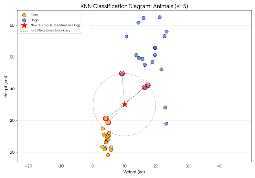

# ML - KNN Model

## Resources
- [k-nearest-neighbor](https://medium.com/swlh/k-nearest-neighbor-ca2593d7a3c4)
- [Model Code](_)
- [KNN](https://medium.com/swlh/k-nearest-neighbor-ca2593d7a3c4)

## Goal
To understand and use KNN for supervised learning.

## K - Nearest Neighbours
- KNN is simply calculates the distance of the test data from the list of training data,thats it.
-   Like you play with your friends and ask them to form groups and new one/friend walks some random steps and based on how close he/she is to all, then he/she belongs to that group that he/she is closest to.
- Moto ~ "Birds of same color,flock togather"
- KNN considers all the features of the data and starts comparing the features to the existing data points, by calculation the distance, KNN assigns this to the group that has more similar matching feature set.

  
  

## Lazy learning paradigm and the KNN algorithm
- Like other algorithms,there is no formal training process for KNN,Instead KNN generate predictions by data feature smilarity and applying distance metrics.

## Usercases
- Handwriting detection.
- Image recognition.
- video recognition.
- Content Recommendations.

## What is K ?
- by now,there should be a open question ? Ok, we are calculation the distance of the data points, but how many points to be considered ?, this is K - a hyperparam.

## How to Calculate Distance ?
- [Points & Distance](distance)

## Algo & Sudo Code
- KNN identifies the K closest data points based on distance. Each point is assigned to a specific group if it falls close enough to that group’s perimeter.
#### For Regression
- KNN predicts based on the mean or median of the K nearest neighbors.
#### For Classification
- KNN predicts by selecting the most common class (mode) among the K nearest points.

### Sudo Code

#### What We Need (Inputs):
- **A Dataset D**: A collection of labeled training examples
- **A Distance Metric**: A way to measure how similar or different two data points are (like Euclidean distance or Manhattan distance)
- **A Number K**: How many nearest neighbors we want to consider
- **A New Observation X**: The data point we want to make a prediction for

#### How KNN Works (Step by Step):

**Step 1: Calculate Distances**

For every single training example in our dataset, we measure how far it is from our new observation X. We use our chosen distance metric (like measuring distance on a map) to find this distance. We create a list showing each training point and how far it is from X.

*Example: If X is the point (7, 7), we measure the distance from (7, 7) to every other point in our training data.*

**Step 2: Select the K Nearest Neighbors**

Once we have all the distances, we sort them from smallest to largest. Then we pick the K closest points - the ones with the smallest distances. These are our "nearest neighbors."

*Example: If K=3, we pick the 3 training points that are closest to our new observation X.*

**Step 3: Make a Prediction**

Now comes the interesting part - how we use these K neighbors to make our prediction depends on what task we're doing:

- **For Regression** (predicting a number): We take all the values (y-values) of our K nearest neighbors and calculate their average (mean). This average is our prediction.
  
- **For Classification** (predicting a category): We look at all the class labels (categories) of our K nearest neighbors and pick the one that appears most frequently. This most common label is our prediction.

---

### Example: Classification Task

**Imagine we have:**
- Training data with points that are either **Red** or **Blue**
  - Point (2,2) is Red
  - Point (3,3) is Red
  - Point (8,8) is Blue
  - Point (9,9) is Blue
- We want to predict the color of a new point X at (7,7)
- We decide K = 3 (look at 3 nearest neighbors)
- **Distance Metric Used**: Euclidean Distance (straight-line distance between two points)
  - Formula: $ d = \sqrt{(x_2 - x_1)^2 + (y_2 - y_1)^2} $

**What happens:**

1. **Calculate Distances**: We measure how far (7,7) is from each point using Euclidean distance:
   - Distance to (2,2) = 7.07 units away → Red
   - Distance to (3,3) = 5.66 units away → Red
   - Distance to (8,8) = 1.41 units away → Blue
   - Distance to (9,9) = 2.83 units away → Blue

2. **Select K=3 Nearest Neighbors**: We pick the 3 closest points:
   - (8,8) → Blue (1.41 units away) ✓
   - (9,9) → Blue (2.83 units away) ✓
   - (3,3) → Red (5.66 units away) ✓

3. **Make Prediction**: We count which color appears most in our 3 neighbors:
   - Blue appears 2 times
   - Red appears 1 time
   - **We predict: X(7,7) is BLUE** because Blue is the most common label ✓

---

### Example: Regression Task

**Imagine we're trying to predict a number based on similar training examples:**
- Training data:
  - When input is 2, output is 4
  - When input is 3, output is 5
  - When input is 8, output is 16
  - When input is 9, output is 18
- We want to predict the output for a new input X = 7
- We decide K = 3 (use 3 nearest neighbors)
- **Distance Metric Used**: Euclidean Distance (in 1D, this simplifies to absolute difference)
  - Formula: $ d = |x_2 - x_1| $

**What happens:**

1. **Calculate Distances**: We measure how far 7 is from each input using Euclidean distance:
   - Distance to 2 = 5 units → output value is 4
   - Distance to 3 = 4 units → output value is 5
   - Distance to 8 = 1 unit → output value is 16
   - Distance to 9 = 2 units → output value is 18

2. **Select K=3 Nearest Neighbors**: We pick the 3 closest:
   - Input 8 (1 unit away) → output 16 ✓
   - Input 9 (2 units away) → output 18 ✓
   - Input 3 (4 units away) → output 5 ✓

3. **Make Prediction**: We take the average of the output values:
   - Average = (16 + 18 + 5) ÷ 3 = 39 ÷ 3 = **13**
   - **We predict: When input is 7, output will be 13** ✓

---

## Key Observations:

| Aspect | What It Means | Alternatives|
|--------|---|---------|
| **Lazy Learning** | KNN doesn't "train" like other algorithms - it just remembers all the training data and uses it directly when making predictions | Decision Trees, Random Forest, SVM - these algorithms have a formal training phase where they learn patterns from data |
| **K Size Matters** | A smaller K (like K=1) makes predictions based on very close neighbors only. A larger K (like K=10) considers more neighbors and is more stable | You need to experiment and find the best K value for your specific problem using cross-validation |
| **Distance Matters** | The choice of distance metric is important - different distance measures can give different results | Common metrics: Euclidean (straight-line distance), Manhattan (grid distance), Cosine (angle between vectors) |
| **No Training Phase** | KNN has basically zero training time since there's nothing to learn beforehand | Other algorithms like Linear Regression or Neural Networks spend time learning optimal parameters during training |
| **Slow at Prediction** | KNN is slow when predicting because it has to calculate distance to every single training example | Use approximate nearest neighbor algorithms like KD-Trees or Ball Trees to speed up distance calculations |
| **Works with Both** | KNN can handle both classification (predicting categories) and regression (predicting numbers) with the same algorithm | Most other algorithms specialize in one task - you'd use Logistic Regression for classification and Linear Regression for regression |

---

### When to Use KNN
- Your dataset is relatively small (KNN gets slow with large datasets)
- You care more about accuracy than speed
- Your data doesn't have obvious patterns (KNN is good at finding local patterns)
- You have features that are meaningful to measure distance on

### When to avoid KNN
- the curse of dimentionality,KNN suffers from larger dimentions,As the number of features grows, KNN requires increasingly more data, which can lead to overfitting. This happens because it becomes difficult to distinguish relevant data points from noise.
- Your dataset is huge (calculating distances to millions of points is slow)
- You need predictions to be fast (for real-time systems)
- You have many features/dimensions (distances become less meaningful)

## k value and its effects
|   Aspect |   Center Point|	Outlier Point|
|----------|---------------|-----------------|
|   Small k |	Sensitive to local noise|	Captures true local structure
|   Medium k |	Smooth, stable predictions|	Starts including irrelevant points
|   Large k |	Approaches global prior (stable but biased)|	Severely contaminated by distant points
|   k = n |    Always predicts global majority class|	Always predicts global majority class

## FAQ - covered in KNN advanced.
1. what happens when the data is exactly between the 2 groups ?
2. Is randomization during training enough ?
3. how to choose K for the best fit?
4. since by adding points one by one the distance calculation will go to O(n^2) how does knn optimizes this, or how does KNN scale for large datasets ?

